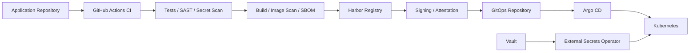

# CloudGenius OPIP GitOps

**Client overview:** [Client-facing case study](./CASE-STUDY.md)

## Outcome & Evidence

| Evidence | Result |
|---|---|
| Delivery model | GitOps; CI does not directly apply to the cluster |
| Reconciliation | Argo CD |
| Environment structure | Reusable base + dev/prod overlays |
| Container hardening | Non-root, dropped capabilities, no privilege escalation, runtime-default seccomp |
| Availability controls | Readiness and liveness probes |
| Resource governance | CPU/memory requests and limits |
| Secret handling | Secrets referenced externally; not stored in Git |
| Image strategy | Immutable digest promotion model documented |

**Proof:** Kubernetes manifests, Argo CD resources, Kustomize overlays, security settings, and the [client-facing case study](./CASE-STUDY.md) are included in this repository.

## Architecture at a glance



---

Public portfolio repository for the Kubernetes continuous-delivery side of the CloudGenius OPIP platform.

## Delivery model

```text
Application repository
  -> GitHub Actions CI
  -> tests + SonarQube + Semgrep + Gitleaks
  -> build + Trivy + Grype + SBOM
  -> Harbor
  -> Cosign signing/attestation
  -> update this GitOps repository
  -> Argo CD
  -> Kubernetes
```

The application pipeline does **not** run `kubectl apply`. Git is the desired-state source of truth and Argo CD is responsible for reconciliation.

## Repository layout

```text
apps/opip/base/            reusable Kubernetes resources
apps/opip/overlays/dev/    development environment
apps/opip/overlays/prod/   production environment
argocd/                    Argo CD Application resources
```

## Security principles

- No credentials, kubeconfigs, private keys, tokens, or Kubernetes Secret values are committed.
- Harbor authentication is referenced through an `imagePullSecret` named `harbor-pull`; create it out-of-band or preferably synchronize it from Vault with External Secrets Operator.
- Application images are intended to be promoted by immutable digest after CI publication and Cosign verification.
- Containers run as non-root, drop Linux capabilities, disable privilege escalation, and use the runtime-default seccomp profile.
- Readiness/liveness probes and CPU/memory requests and limits are defined.
- Dev and prod are separate Kustomize overlays.

## Image promotion

The manifests initially reference the `main` image alias so the repository is readable before the first automated promotion. The CI/CD integration will replace the overlay image references with immutable Harbor digests such as:

```text
harbor.cloudgenius.ca/opip/opip-api@sha256:<digest>
harbor.cloudgenius.ca/opip/opip-frontend@sha256:<digest>
```

Production changes should be promoted through reviewed Git changes rather than direct cluster mutation.

## Ingress

The example ingress hosts are intentionally portfolio-safe placeholders. Replace them with the DNS names assigned to the environment before enabling the Argo CD Applications.

## Secrets

Recommended runtime pattern:

```text
HashiCorp Vault -> External Secrets Operator -> Kubernetes Secret -> workload
```

The `harbor-pull` secret is referenced but never stored in this repository.

---

## Consulting relevance

This repository demonstrates a GitOps operating model for teams that want controlled, auditable Kubernetes delivery rather than direct cluster mutation from CI.

Typical consulting use cases include:

- Kubernetes platform engineering;
- Argo CD / GitOps adoption;
- Kustomize environment design;
- secure image promotion;
- secrets-management architecture;
- DevSecOps controls;
- production delivery standards and technical leadership.

**Consulting inquiries:** advisory@cloudgenius.ca · https://cloudgenius.ca

